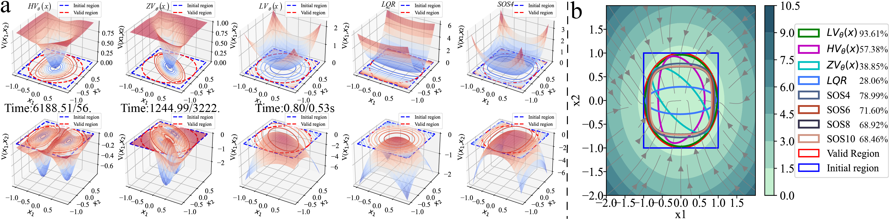

# LVX
## Transient Stability Analysis of Networked Microgrids Using Rapid Neural Lyapunov Method

Abstract
----------
The transient stability analysis (TSA) of power-electronics-interfaced microgrids has a vital role in secure system operation. Such analysis normally entails extremely nonlinear and complex dynamics. Nearly all of the current studies have addressed this problem by making further assumptions in the system dynamics, and there remains an overall lack of a effective and general solution. Therefore, this paper proposes a novel neural Lyapunov framework with a trial solution structure for the TSA, which is a learning-based approach. On top of that, the modules that have been included within the framework consist of both a learning and a falsification module. In general, the learning module iteratively learns the candidate Lyapunov functions via deep neural networks. The falsification module guides the learning process to satisfy the Lyapunov conditions and guarantees provable stability. The learned neural Lyapunov function attempts to identify the disturbances that the networked microgrid tolerates through the estimated region of attraction (ROA) in addition to determining large-signal stability. Applications of this method for a power electronics interfaced microgrids are presented and multiple case studies are used to validate the suggested strategy. The findings demonstrate how the suggested framework expands the ROA while being quick, effective, and generalizable. Our model is open-sourced at https://github.com/YunDuanFei/LVX.

--------------------------------------------------
Schematics diagram of a microgrid-based distribution grid. The physical structure of the microgrid distributed generation units and loads is shown in the blue dashed box on the left.

<p align="center">

</p>

(a) Visualization of different NN approaches with rigorous δ falsification. (b) The ROA estimated by our method is significantly larger than the LQR. "SOS4" indicates that the highest order of the SOS-estimated Lyapunov function is a fourth-order polynomial.

<p align="center">

</p>


## Citation

If you use this benchmark in your research, please cite this paper.

```
@ARTICLE{10208158,
  author={Liu, Yunfei and Zhang, Junran and Liu, Yan and Yang, Mengling and Chen, Song and Zhou, Lijun and Wang, Yang},
  journal={IEEE Transactions on Smart Grid}, 
  title={An Improved Neural Lyapunov Method for Transient Stability Assessment of Networked Microgrids}, 
  year={2023},
  doi={10.1109/TSG.2023.3301855}}
```


## Contact Information

If you have any suggestion or question, you can contact us by: liuyunfei_215@163.com. Thanks for your attention!